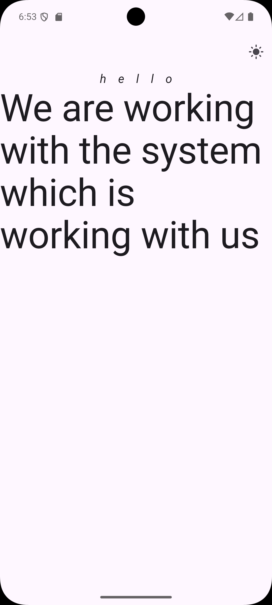

# Dark-light-mode-theme-flutter

# 📸 Screenshots

  
  

 ThemeMode _themeMode=ThemeMode.light;

  void _toggleTheming(){
    setState(() {
      _themeMode = _themeMode == ThemeMode.light ? ThemeMode.dark : ThemeMode.light;
    });
  }

    themeMode: _themeMode,
      theme: ThemeData(
        primaryColor: Colors.orange,
        brightness: Brightness.light,
        colorScheme: .fromSeed(seedColor: Colors.deepPurple),
      ),
      darkTheme: ThemeData(
        primaryColor: Colors.white,
        brightness: Brightness.dark,
      ),

      
class HomeScreen extends StatefulWidget {
  final VoidCallback theming;

  HomeScreen({super.key, required this.theming});

  @override
  State<HomeScreen> createState() => _HomeScreenState();
}

class _HomeScreenState extends State<HomeScreen> {

  @override
  Widget build(BuildContext context) {
    
 bool isDark = Theme.of(context).brightness == Brightness.dark;
    return Scaffold(
      appBar: AppBar(
        actions: [
          IconButton(onPressed: widget.theming, icon:Icon(isDark ? Icons.dark_mode : Icons.light_mode)),
        ],
      ),
